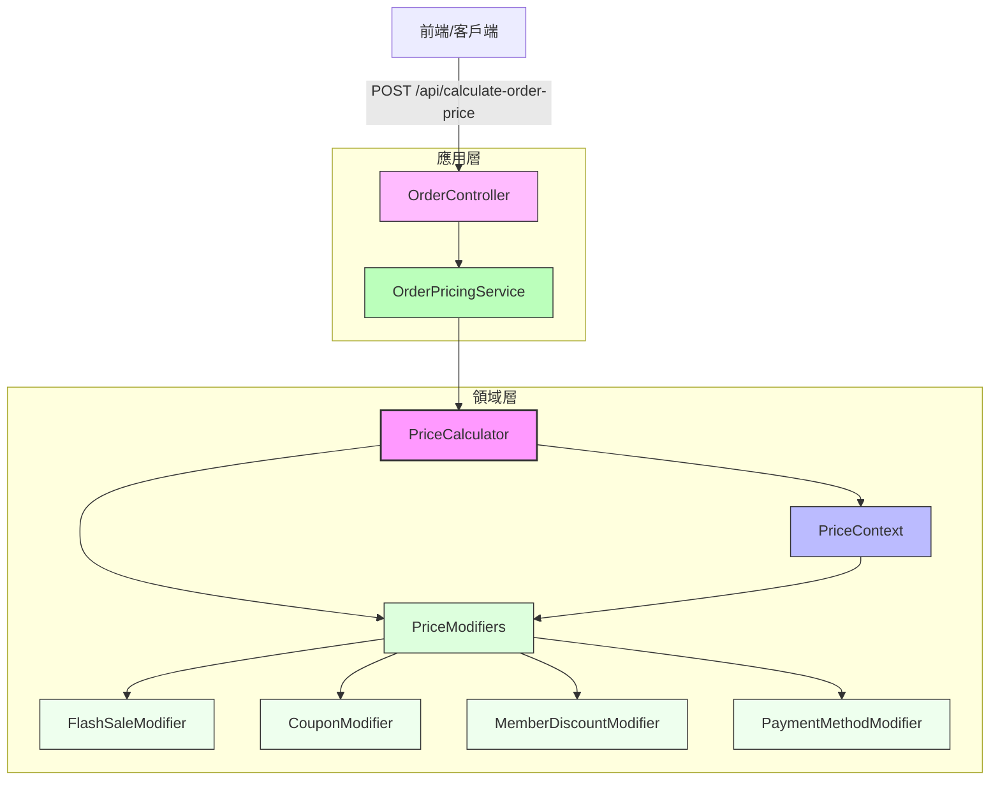

# Laravel Modular Pricing Engine

這是一個基於 Laravel 的模組化價格計算引擎，模擬真實電商場景中複雜的價格計算需求，例如促銷活動、會員分級折扣、優惠券、支付方式回饋等。專案採用策略模式、責任鏈模式與裝飾器模式，實現靈活、可擴充的架構，適合用來學習進階 Laravel 應用或作為開源專案展示。我們力求結構清晰、邏輯乾淨，方便開發者快速上手。

## 專案目的
本專案旨在解決電商系統中常見的價格計算挑戰，提供一個可重用、可測試的解決方案。主要目標：
- 展示如何用**策略模式**與**責任鏈模式**實現靈活的價格修飾邏輯。
- 透過**裝飾器模式**設計可擴展的通知系統（目前為示範）。
- 遵循 DDD（領域驅動設計）基本原則，將價格計算邏輯與應用層分離。
- 提供完整的單元測試與功能測試，確保邏輯可靠。

專案預設使用 SQLite 作為資料庫，方便快速部署，並提供 API 端點供前端或 Postman 測試。

## 技術亮點
- ✅ 基於策略模式與責任鏈模式，靈活組合複雜商業邏輯。
- ✅ 符合開閉原則，新增價格修飾器無需修改核心代碼。
- ✅ 使用 DDD 領域模型與 DTO（PriceContext）管理數據流。
- ✅ 測試驅動設計，單元測試與功能測試覆蓋核心邏輯與 API。
- ✅ 透過 `config/pricing.php` 配置修飾器順序，易於維護與擴充。
- ✅ 支援 CI/CD，內建 GitHub Actions 自動化測試流程。

## 環境需求
- PHP >= 8.2
- Composer
- SQLite（或 MySQL/PostgreSQL，需調整 `.env` 設定）
- Laravel 10.x
- （可選）Node.js（若需前端資源編譯）

## 安裝步驟
1. 克隆或下載專案：
   ```bash
   git clone https://github.com/<your-repo>/modular-pricing-engine.git
   cd modular-pricing-engine
   ```
2. 安裝 PHP 依賴：
   ```bash
   composer install
   ```
3. 複製環境設定檔並生成應用金鑰：
   ```bash
   cp .env.example .env
   php artisan key:generate
   ```
4. 設定資料庫（預設為 SQLite）：
   ```bash
   mkdir -p database
   touch database/database.sqlite
   php artisan migrate
   ```
   若使用 MySQL 或 PostgreSQL，請在 `.env` 中調整 `DB_CONNECTION` 等設定。
5. 啟動本地伺服器：
   ```bash
   php artisan serve
   ```
   應用將運行在 `http://localhost:8000`。

## 環境變數說明
以下是 `.env.example` 中的關鍵變數與其用途：
- `APP_NAME`：應用程式名稱，預設為 "Laravel Modular Pricing Engine"。
- `APP_ENV`：環境模式，預設為 `local`，部署時可改為 `production`。
- `DB_CONNECTION`：資料庫類型，預設為 `sqlite`，可改為 `mysql` 或 `postgresql`。
- `DB_DATABASE`：資料庫路徑，SQLite 預設為 `database/database.sqlite`。
- `MAIL_MAILER`：通知郵件寄送方式，預設為 `log`，正式環境可改為 `smtp` 或 `ses`。

完整設定請參考 `.env.example`，並根據需求調整。

## 使用方式
專案提供一個核心 API 端點，用於計算訂單最終價格：

- **端點**：`POST /api/calculate-order-price`
- **請求格式**（JSON）：
  ```json
  {
      "original_price": 1000.0,
      "items": [
          {
              "id": 1,
              "name": "Test Item",
              "price": 1000,
              "qty": 1,
              "is_flash_sale": true
          }
      ],
      "user_id": 1,
      "coupon_code": "SAVE20",
      "payment_method": "line_pay"
  }
  ```
- **回應範例**：
  ```json
  {
      "original_price": 1000.0,
      "final_price": 772.73,
      "modifications": {
          "flash_sale": -150.0,
          "coupon_discount": -20.0,
          "member_discount": -41.5,
          "payment_method_discount": -15.77
      },
      "details": "Price calculated successfully with applied modifiers.",
      "context": {
          "user_id": 1,
          "user_member_level": "gold",
          "coupon_code_used": "SAVE20",
          "payment_method_used": "line_pay"
      }
  }
  ```

可用 Postman 或 cURL 測試 API。建議使用以下 Postman Collection 快速體驗：

[Postman Collection](https://www.postman.com/<your-postman-collection-link>)

### 測試執行
專案包含單元測試與功能測試，執行以下命令：
```bash
vendor/bin/phpunit
```

生成測試覆蓋率報告：
```bash
vendor/bin/phpunit --coverage-html coverage
```
報告將生成於 `coverage/` 目錄，可用瀏覽器查看詳細覆蓋率。

## 架構概覽
專案採用模組化設計，核心邏輯位於 `app/Domain/Price` 和 `app/Services`。以下是架構流程圖：



### 主要元件說明
- **OrderController**（`app/Http/Controllers`）：處理 HTTP 請求，驗證輸入並呼叫服務層。
- **OrderPricingService**（`app/Services`）：應用層服務，負責協調價格計算，注入上下文（如用戶、支付方式）。
- **PriceCalculator**（`app/Domain/Price`）：核心計算引擎，按優先級應用修飾器（責任鏈模式）。
- **PriceContext**（`app/Domain/Price/DTO`）：DTO，記錄原始價格、當前價格與折扣紀錄。
- **PriceModifiers**（`app/Domain/Price/Modifiers`）：獨立價格修飾器（如閃購、優惠券），實現策略模式。每個修飾器可作為模組重用，新增修飾器只需實作 `PriceModifierInterface` 並註冊於 `config/pricing.php`。

通知邏輯（`app/Domain/Notifications`）目前為示範，展示裝飾器模式應用。

## 開發者導覽
以下是專案關鍵檔案與其責任，幫助你快速上手：

| 檔案路徑 | 功能 |
|----------|------|
| `app/Domain/Price/PriceCalculator.php` | 負責按優先級應用所有修飾器，核心計算邏輯。 |
| `app/Domain/Price/DTO/PriceContext.php` | 價格計算的上下文，管理價格與折扣紀錄。 |
| `app/Domain/Price/Modifiers/*.php` | 各價格修飾器，實現具體折扣邏輯。 |
| `app/Services/OrderPricingService.php` | 應用層服務，橋接控制器與領域層。 |
| `config/pricing.php` | 配置修飾器順序與通知裝飾器。 |
| `tests/Unit/PriceCalculatorTest.php` | 單元測試，驗證計算邏輯。 |
| `tests/Feature/OrderPricingTest.php` | 功能測試，模擬 API 請求。 |

### 新增自訂修飾器範例
若需新增「節日折扣」修飾器：
1. 建立類別：
   ```php
   // app/Domain/Price/Modifiers/HolidayDiscountModifier.php
   namespace App\Domain\Price\Modifiers;

   use App\Domain\Price\Contracts\PriceModifierInterface;
   use App\Domain\Price\DTO\PriceContext;
   use Carbon\Carbon;

   class HolidayDiscountModifier implements PriceModifierInterface
   {
       public function apply(PriceContext $context): PriceContext
       {
           if (Carbon::now()->isSameDay(Carbon::parse('2025-12-25'))) {
               $discount = -$context->currentPrice * 0.1; // 聖誕節10%折扣
               $context->addModification('holiday_discount', $discount);
           }
           return $context;
       }

       public function getPriority(): int
       {
           return 120; // 介於閃購(100)與優惠券(150)之間
       }
   }
   ```
2. 註冊至 `config/pricing.php`：
   ```php
   'modifiers' => [
       FlashSaleModifier::class,
       HolidayDiscountModifier::class, // 新增
       CouponModifier::class,
       MemberDiscountModifier::class,
       PaymentMethodModifier::class,
   ],
   ```
3. 測試新修飾器：
   ```php
   // tests/Unit/PriceCalculatorTest.php
   public function it_applies_holiday_discount_correctly()
   {
       $this->travelTo(Carbon::parse('2025-12-25'));
       $calculator = new PriceCalculator([new HolidayDiscountModifier()]);
       $context = new PriceContext(originalPrice: 200.0, items: []);
       $finalContext = $calculator->calculate($context);
       $this->assertEquals(180.0, $finalContext->currentPrice); // 200 * 0.9
       $this->travelBack();
   }
   ```

## CI/CD 與自動化
專案內建 GitHub Actions 工作流（`.github/workflows/ci.yml`），自動執行：
- 依賴安裝
- 資料庫遷移
- 測試運行
- 測試覆蓋率報告（透過 Coveralls 上傳）

請在 GitHub 設置中配置 Coveralls 集成，確保 Coverage Badge 正常顯示。

## 常見問題 (FAQ)

### 這個專案的核心價格計算邏輯採用了哪些設計模式？為什麼選擇這些模式？
核心價格計算採用了**策略模式**與**責任鏈模式**。我們將不同價格修飾邏輯（如會員折扣、閃購、優惠券）封裝成獨立的策略（`PriceModifier` 實現類），每種修飾器專注於單一邏輯，保持高內聚。  
責任鏈模式則用於組織修飾器的執行順序，`PriceCalculator` 按優先級（透過 `getPriority()`）依次調用修飾器，將 `PriceContext` 在鏈中傳遞，確保修改邏輯互不干擾。  
這樣的設計符合**開閉原則**，允許新增修飾器而不改動核心代碼。此外，通知系統示範了**裝飾器模式**，可動態擴展通知行為（如日誌記錄、延遲發送）。

### `PriceContext` DTO 在專案中扮演什麼角色？為什麼需要它？
`PriceContext` 是一個資料傳輸物件（DTO），作為價格計算流程的狀態容器，封裝原始價格、當前價格、訂單商品、用戶資訊、優惠券代碼等數據。  
它在責任鏈中傳遞，確保修飾器間不直接依賴外部狀態，保持獨立性。同時，它記錄每一步的折扣修改，方便追蹤計算過程，提升可維護性與可測試性。

### 如何確保價格修飾器按正確順序執行？順序錯誤會有什麼影響？
修飾器順序透過 `PriceModifierInterface` 的 `getPriority()` 方法與 `config/pricing.php` 的配置控制。`PriceCalculator` 在初始化時按優先級（值越小越先執行）排序修飾器。  
若順序錯誤，可能導致價格計算偏差。例如，若會員折扣先於閃購應用，折扣基數為原始價格；若閃購先應用，則基數為閃購後價格，這可能違反商業邏輯，甚至造成負價格等錯誤。

### 模組化引擎如何與 Laravel 框架整合？
我們透過 `PricingEngineServiceProvider` 將 `PriceCalculator` 與 `OrderPricingService` 綁定至 Laravel 服務容器。服務提供者從 `config/pricing.php` 讀取修飾器配置，動態解析並注入 `PriceCalculator`。  
在 `OrderController` 中，僅需依賴注入 `OrderPricingService`，框架會自動解析實例，實現控制器與領域邏輯的解耦，提升可維護性。

### `FlashSaleModifier` 和 `CouponModifier` 的資料目前如何處理？未來如何改進？
目前，`FlashSaleModifier` 的閃購時間與 `CouponModifier` 的優惠券資料為硬編碼，僅用於演示。  
未來會透過資料庫管理這些資料，引入 `FlashSaleRepository` 或 `CouponService` 分離資料獲取邏輯。為提升性能，可用 Redis 快取頻繁查詢的資料（如活躍促銷活動），減少資料庫負載。

### 專案如何進行測試？單元測試與功能測試有何不同？
專案包含**單元測試**（`PriceCalculatorTest`）與**功能測試**（`OrderPricingTest`）。  
- **單元測試**：聚焦領域邏輯，驗證單個修飾器或 `PriceCalculator` 的正確性，不依賴資料庫或 HTTP，執行速度快。  
- **功能測試**：模擬 API 請求，測試端到端流程，包括控制器、服務層與領域層整合，確保回應結構與結果正確。  
我們使用 `RefreshDatabase` 確保測試環境乾淨，並透過 Carbon 的 `travelTo` 模擬時間，方便測試如閃購的時間敏感邏輯。

### 專案如何體現模組化與可擴展性？
模組化體現於每個 `PriceModifier` 作為獨立模組，僅處理特定折扣邏輯，透過 `PriceContext` 介面交互，實現高內聚、低耦合。  
可擴展性則透過開閉原則實現：新增折扣只需實作 `PriceModifierInterface` 並註冊至 `config/pricing.php`，無需改動核心代碼。服務容器綁定也便於替換實現。

### DDD（領域驅動設計）在專案中如何應用？
我們遵循 DDD 基本原則，將價格計算定義為核心領域，邏輯封裝於 `app/Domain/Price`。  
`PriceContext` 作為領域物件，管理計算狀態；`PriceModifier` 實現領域服務，處理具體規則。應用層（`OrderController`、`OrderPricingService`）僅協調領域邏輯，不含業務規則，實現領域與應用的解耦。

### 若要改進專案，你會從哪些方面入手？
- **資料動態化**：將閃購與優惠券資料移至資料庫，透過 Repository 管理。
- **性能優化**：引入 Redis 快取，減少資料庫查詢。
- **通知系統**：實現真實 Email/SMS 發送，擴展裝飾器（如重試、異步）。
- **多租戶支援**：完善 `InitializeTenancy` 中間件，支援多租戶場景。

## 未來改進
- 實作完整通知系統（Email、SMS）。
- 加入 Redis 快取，優化閃購與優惠券查詢。
- 擴展商品模型，支援更細緻的價格規則。
- 支援多租戶（目前僅保留 `InitializeTenancy` 中間件）。
- 部署免費 Demo API（例如 Vercel + SQLite）。

## 注意事項
- 閃購時間硬編碼於 `FlashSaleModifier.php`，實務上需從資料庫動態取得。
- 優惠券資料模擬於 `CouponModifier.php`，建議改用資料庫儲存。
- 預設使用 SQLite，正式環境建議切換至 MySQL 或 PostgreSQL。
- 測試中涉及時間的操作（如閃購）使用 Carbon 的 `travelTo`，請注意測試環境時間。

## 貢獻
歡迎提交 Issue 或 PR！若有建議或問題，我們會認真回應，謝謝你的參與！

## 授權
本專案採用 MIT 授權，詳見 `composer.json`。
