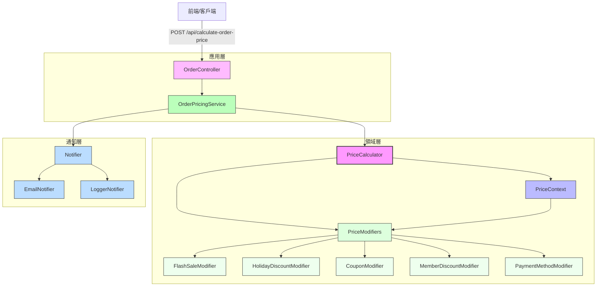

# Laravel Modular Pricing Engine

這是一個基於 Laravel 的模組化價格計算引擎，模擬真實電商場景中複雜的價格計算需求，例如促銷活動、會員分級折扣、優惠券、支付方式回饋等。專案採用策略模式、責任鏈模式與裝飾器模式，實現靈活、可擴充的架構，適合學習進階 Laravel 應用或作為開源專案展示。我們力求結構清晰、邏輯乾淨，方便開發者快速上手。

[](https://github.com/BpsEason/modular-pricing-engine/actions)
[](https://coveralls.io/github/BpsEason/modular-pricing-engine?branch=main)

## 專案目的
本專案旨在解決電商系統中常見的價格計算挑戰，提供一個可重用、可測試的解決方案。主要目標：
- 展示如何用**策略模式**與**責任鏈模式**實現靈活的價格修飾邏輯。
- 透過**裝飾器模式**設計可擴展的通知系統（支援日誌與模擬郵件通知）。
- 遵循 DDD（領域驐動設計）基本原則，將價格計算邏輯與應用層分離。
- 提供完整的單元測試與功能測試，確保邏輯可靠。

專案預設使用 SQLite 作為資料庫，方便快速部署，並提供 API 端點供前端或 Postman 測試。

## 技術亮點
- ✅ 基於策略模式與責任鏈模式，靈活組合複雜商業邏輯。
- ✅ 符合開閉原則，新增價格修飾器無需修改核心代碼。
- ✅ 使用 DDD 領域模型與 DTO（PriceContext）管理數據流。
- ✅ 測試驅動設計，單元測試與功能測試覆蓋核心邏輯與 API。
- ✅ 透過 `config/pricing.php` 配置修飾器順序與通知裝飾器，易於維護與擴充。
- ✅ 支援 CI/CD，內建 GitHub Actions 自動化測試流程。

## 環境需求
- PHP >= 8.2
- Composer
- SQLite（或 MySQL/PostgreSQL，需調整 `.env` 設定）
- Laravel 11.x
- （可選）Node.js（若需前端資源編譯）

## 安裝步驟
1. 克隆或下載專案：
   ```bash
   git clone https://github.com/BpsEason/modular-pricing-engine.git
   cd modular-pricing-engine
   ```
2. 安裝 PHP 依賴：
   ```bash
   composer install
   ```
3. 複製環境設定檔並生成應用金鑰：
   ```bash
   cp .env.example .env
   php artisan key:generate
   ```
4. 設定資料庫（預設為 SQLite）：
   ```bash
   mkdir -p database
   touch database/database.sqlite
   php artisan migrate
   ```
   若使用 MySQL 或 PostgreSQL，請在 `.env` 中調整 `DB_CONNECTION` 等設定。
5. 啟動本地伺服器：
   ```bash
   php artisan serve
   ```
   應用將運行在 `http://localhost:8000`。

## 環境變數說明
以下是 `.env.example` 中的關鍵變數與其用途：
- `APP_NAME`：應用程式名稱，預設為 "Laravel Modular Pricing Engine"。
- `APP_ENV`：環境模式，預設為 `local`，部署時可改為 `production`。
- `DB_CONNECTION`：資料庫類型，預設為 `sqlite`，可改為 `mysql` 或 `postgresql`。
- `DB_DATABASE`：資料庫路徑，SQLite 預設為 `database/database.sqlite`。
- `MAIL_MAILER`：通知郵件寄送方式，預設為 `log`，正式環境可改為 `smtp` 或 `ses`。

完整設定請參考 `.env.example`，並根據需求調整。

## 使用方式
專案提供一個核心 API 端點，用於計算訂單最終價格：

- **端點**：`POST /api/calculate-order-price`
- **請求格式**（JSON）：
  ```json
  {
      "original_price": 1000.0,
      "items": [
          {
              "id": 1,
              "name": "Test Item",
              "price": 500,
              "qty": 1
          },
          {
              "id": 2,
              "name": "Another Item",
              "price": 250,
              "qty": 2
          }
      ],
      "user_id": 1,
      "coupon_code": "SAVE20",
      "payment_method": "credit_card_visa"
  }
  ```
- **回應範例**：
  ```json
  {
      "original_price": 1000.0,
      "final_price": 651.7,
      "modifications": {
          "flash_sale": -200.0,
          "holiday_discount": -80.0,
          "coupon_discount": -20.0,
          "member_discount": -35.0,
          "payment_method_discount": -13.3
      },
      "message": "Price calculated successfully."
  }
  ```

可用 Postman 或 cURL 測試 API。建議使用以下 Postman Collection 快速體驗：

[Postman Collection](https://www.postman.com/<your-postman-collection-link>)

### 測試執行
專案包含單元測試與功能測試，執行以下命令：
```bash
vendor/bin/phpunit
```

生成測試覆蓋率報告：
```bash
vendor/bin/phpunit --coverage-clover coverage.xml
```
報告將生成於 `coverage.xml`，並透過 Coveralls 顯示覆蓋率。

## 架構概覽
專案採用模組化設計，核心邏輯位於 `app/Domain/Price` 和 `app/Services`。以下是架構流程圖，展示資料如何從前端流經應用層、領域層和通知層：



### 架構解析
1. **應用層**：
   - **OrderController**：處理 HTTP 請求，驗證輸入並委派給服務層。
   - **OrderPricingService**：協調價格計算和通知，構建 `PriceContext` 並調用 `PriceCalculator`。
2. **領域層**：
   - **PriceCalculator**：核心計算引擎，按優先級應用修飾器（責任鏈模式）。
   - **PriceContext**：DTO，記錄價格狀態（原始價格、當前價格、折扣記錄）。
   - **PriceModifiers**：獨立修飾器（如閃購、優惠券），實現策略模式，可靈活組合。
3. **通知層**：
   - **Notifier**：抽象通知系統，支援日誌記錄和模擬郵件（裝飾器模式）。
   - **EmailNotifier** 和 **LoggerNotifier**：具體通知實現。

**資料流**：前端提交請求 → 控制器驗證 → 服務層協調 → 計算器應用修飾器 → 更新上下文 → 發送通知 → 返回結果。

## 核心代碼示例
以下是價格計算引擎的關鍵代碼，包含詳細註解，展示策略模式與責任鏈模式的應用。

### PriceModifierInterface
```php
<?php
// app/Domain/Price/Contracts/PriceModifierInterface.php

namespace App\Domain\Price\Contracts;

use App\Domain\Price\DTO\PriceContext;

// 定義價格修飾器的統一接口，所有修飾器（如閃購、優惠券）必須實現此接口
interface PriceModifierInterface
{
    /**
     * 應用價格修飾邏輯
     *
     * @param PriceContext $context 當前的價格上下文，包含原始價格、當前價格等資料
     * @return PriceContext 返回修改後的上下文，記錄折扣或調整後的價格
     */
    public function apply(PriceContext $context): PriceContext;

    /**
     * 獲取修飾器的優先級
     *
     * @return int 優先級數值，值越小越先執行（例如，閃購優先級 100，優惠券 150）
     */
    public function getPriority(): int;
}
```

### PriceCalculator
```php
<?php
// app/Domain/Price/PriceCalculator.php

namespace App\Domain\Price;

use App\Domain\Price\Contracts\PriceModifierInterface;
use App\Domain\Price\DTO\PriceContext;
use Illuminate\Support\Collection;

class PriceCalculator
{
    // 儲存修飾器集合，按優先級排序
    private Collection $modifiers;

    /**
     * 建構函數，初始化修飾器集合
     *
     * @param array $modifiers 修飾器實例陣列，從 config/pricing.php 注入
     */
    public function __construct(array $modifiers)
    {
        // 將修飾器陣列轉為 Collection，並按優先級排序（低優先級值先執行）
        $this->modifiers = collect($modifiers)->sortBy(
            fn(PriceModifierInterface $modifier) => $modifier->getPriority()
        );
    }

    /**
     * 執行價格計算，依次應用所有修飾器
     *
     * @param PriceContext $context 初始價格上下文，包含原始價格等資料
     * @return PriceContext 最終價格上下文，包含計算後的價格和折扣記錄
     */
    public function calculate(PriceContext $context): PriceContext
    {
        // 遍歷排序後的修飾器，依次應用每個修飾器的邏輯
        foreach ($this->modifiers as $modifier) {
            $context = $modifier->apply($context);
        }

        // 確保最終價格不為負數，若負數則調整至 0，並記錄最終調整金額
        if ($context->getCurrentPrice() < 0) {
            $finalAdjustment = -$context->getCurrentPrice();
            $context->addModification('final_floor_adjustment', $finalAdjustment);
        }

        // 返回最終的價格上下文
        return $context;
    }
}
```

## 開發者導覽
以下是專案關鍵檔案與其責任，幫助你快速上手：

| 檔案路徑 | 功能 |
|----------|------|
| `app/Domain/Price/PriceCalculator.php` | 負責按優先級應用所有修飾                 ，器核心代碼計算邏輯。 |
| `app/Domain/Price/DTO/PriceContext.php` | 價格計算的上下文，管理價格與折扣記錄。 |
| `app/Domain/Price/Modifiers/*.php` | 各價格修飾器，實現具體折扣邏輯。 |
| `app/Domain/Price/Notifiers/*.php` | 通知系統，支援日誌與模擬郵件發送。 |
| `app/Services/OrderPricingService.php` | 應用層服務，橋接控制器與領域層。 |
| `config/pricing.php` | 配置修飾器順序與通知裝飾器。 |
| `tests/Unit/PriceCalculatorTest.php` | 單元測試，驗證計算邏輯。 |
| `tests/Feature/OrderPricingTest.php` | 功能測試，模擬 API 請求。 |

### 新增自訂修飾器
若需新增「節日折扣」修飾器：
1. 建立類別：
   ```php
   // app/Domain/Price/Modifiers/HolidayDiscountModifier.php
   namespace App\Domain\Price\Modifiers;

   use App\Domain\Price\Contracts\PriceModifierInterface;
   use App\Domain\Price\DTO\PriceContext;
   use Carbon\Carbon;

   class HolidayDiscountModifier implements PriceModifierInterface
   {
       public function apply(PriceContext $context): PriceContext
       {
           if (Carbon::now()->isSameDay(Carbon::parse('2025-12-25'))) {
               $discount = -$context->currentPrice * 0.1; // 聖誕節10%折扣
               $context->addModification('holiday_discount', $discount); //  }
           return $context;
       }

       public function getPriority(): int
       {
           return (int)120; // 介於閃購(100)與優惠券(150）之間
       }
   }
   ```

2. 註冊至 `config/pricing.php`：
   ```php
   return [
       'modifiers' => [
           FlashSaleModifier::class,
           HolidayDiscountModifier::class, // 新增
           CouponModifier::class,
           MemberDiscountModifier::class,
           PaymentMethodModifier::class,
       ],
   ];
   ```

3. 測試新修飾器：
   ```php
   // tests/Unit/PriceCalculatorTest.php
   public function test_holiday_discount_modifier_applies_correctly()
   {
       $this->travelTo(Carbon::parse('2025-12-25'));
       $calculator = new PriceCalculator([new HolidayDiscountModifier()]));
       $context = new PriceContext(originalPrice: 200.0, items: [])); // 200 * 0.9
       $this->travelBack();
   }
   ```

## CI/CD 與自動化
專案內建 GitHub Actions 工作流（`.github/workflows/ci.yml`），自動執行：
- 依賴安裝
- 資料庫設定
- 測試運行
- 測試覆蓋率報告（透過 Coveralls 上傳）

請在 GitHub 設置中配置 Coveralls 集成，確保 Coverage Badge 正常顯示。

## 常見問題 (FAQ)

### 這個專案的核心計算邏輯採用了哪些設計模式？為什麼選擇這些模式？
核心價格計算採用了**策略模式**與**責任鏈模式**。我們將不同價格修飾邏（如會員折扣、閃購、優惠券）封裝成獨立的策略（`PriceModifier` 實現類），每種修飾器專注於單一邏保持高內邏輯，保持邏輯。  
責任鏈模式則用於組織修飾器的執行順序，`PriceCalculator` 按優先級（透過 `getPriority()`）依調用修飾次器，將 `PriceContext` 在鏈中傳遞，確保修改邏輯互不干擾。  
這樣的設計符合**開閉原則**，允許新增修飾器而不改動核心代碼。此外，通知系統採用**裝飾器模式**，透過 `PriceContext` 動態擴展通知行為（如日誌記錄）。

### 如何確保價格修飾器按正確順序執行？順序錯誤會有什麼影響？
修飾器順序透過 `PriceModifierInterface` 的 `getPriority()` 方法與 `config/pricing.php` 的配置控制。`PriceCalculator` 在初始化時按優先級（值越小越先執行）排序修飾器。  
若順序錯誤，可能導致價格計算偏差。例如，若會員折扣先於閃購應用，折扣基數為原始價格；若閃購先應用，則基數為閃購後價格，這可能違反商業邏輯，甚至造成負價格（已透過 `PriceCalculator` 防止）。

### 專案如何體現模組化與可擴展性？
模組化體現於每個 `PriceModifier` 作為獨立模組，僅處理特定折扣邏輯，透過 `PriceContext` 介面交互，實現高內聚低耦合。  
可擴展性則透過開閉原則實現，新增折扣只需實作 `PriceModifierInterface` 並註冊至 `config/pricing.php`，無需改動核心代碼。通知系統同樣可透過新增 `NotifierDecorator` 擴展。

### DDD（領域驅動設計）在專案中如何應用？
我們遵循 DDD 基本原則，將價格計算定義為核心領域，邏輯封裝於 `app/Domain/Price`。  
`PriceContext` 作為領域物件，管理價格狀態；`PriceModifier` 實現領域服務，處理具體規則。應用層（`OrderController`、`OrderPricingService`）僅協調領域邏輯，不含業務規則，實現領域與應用的分離。

## 未來改進
- 實作完整通知系統（Email、SMS）。
- 加入 Redis 快取，優化閃購與優惠券查詢。
- 擴展商品模型，支援更細緻的價格規則。
- 部署免費 Demo API（例如 Vercel + SQLite）。

## 注意事項
- 閃購時間硬編碼於 `FlashSaleModifier.php`，實務上需從資料庫動態取得。
- 優惠券資料模擬於 `CouponModifier.php`，建議改用資料庫儲存。
- 預設使用 SQLite，正式環境建議切換至 MySQL 或 PostgreSQL。
- 測試中涉及時間的操作（如閃購）使用 Carbon 的 `travelTo`，請注意測試環境時間。

## 貢獻
歡迎提交 Issue 或 PR！若有建議或問題，我們會認真回應，謝謝你的參與！

## 授權
本專案採用 MIT 授權，詳見 `LICENSE`。

---

感謝你的使用！如果有任何問題，隨時開 Issue，我們會盡快協助。
